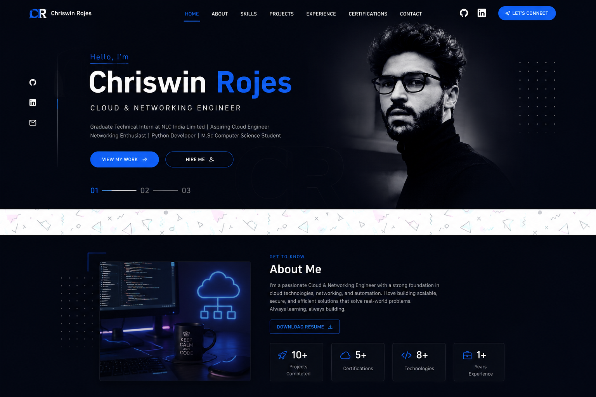

# Chriswin Rojes — Portfolio

A premium, dark-mode personal portfolio for **Chriswin Rojes**, Cloud & Networking Engineer.
Built with a split-screen hero, large typography, glassmorphism cards, blue glow effects and
smooth Framer Motion animations — inspired by Apple, Vercel and modern designer portfolios.



## ✨ Features

- ⚡ **Split-screen hero** with animated particle network, dot grid & blue glow
- 🌗 **Light / Dark theme toggle** in the navbar (defaults to light, remembers your choice)
- 🎨 **Electric blue accent** (`#3B82F6`) with a deep-blue `#050816` dark mode
- 🔠 **Poppins** typography with large, bold headings
- 🧩 **Glassmorphism** project & certification cards with hover animations
- 📊 **Animated skill bars**, stats counters and a timeline for experience
- 🌀 **Framer Motion** scroll & section animations + scroll progress bar
- 📱 Fully **responsive** with a mobile navigation drawer
- 🔍 **SEO optimized** (Open Graph, Twitter, semantic markup)
- 🧱 **Reusable components** and a single source-of-truth data file
- ⏳ Loading animation

## 🛠 Tech Stack

- **React 18 + TypeScript**
- **Vite**
- **Tailwind CSS**
- **Framer Motion**
- **Lucide React** (icons)
- **React Router**

## 🚀 Getting Started

```bash
# 1. Install dependencies
npm install

# 2. Start the dev server (opens http://localhost:5173)
npm run dev

# 3. Build for production
npm run build

# 4. Preview the production build
npm run preview
```

## 🖼 Adding Your Images

Drop these files into the `public/` folder (placeholders are shown until you do):

| File              | Used in        | Recommended size       |
| ----------------- | -------------- | ---------------------- |
| `public/profile.jpg` | Hero (right)   | Portrait ~800×1000     |
| `public/about.jpg`   | About section  | Square ~800×800        |
| `public/resume.pdf`  | Resume buttons | —                      |

## 📁 Project Structure

```
portfolio/
├── public/                # Static assets (add profile.jpg, about.jpg, resume.pdf)
│   └── favicon.svg
├── src/
│   ├── components/        # Reusable UI sections
│   │   ├── Navbar.tsx
│   │   ├── Hero.tsx
│   │   ├── About.tsx
│   │   ├── Skills.tsx
│   │   ├── Projects.tsx
│   │   ├── Experience.tsx
│   │   ├── Certifications.tsx
│   │   ├── Contact.tsx
│   │   ├── Footer.tsx
│   │   ├── Loader.tsx
│   │   ├── ParticleBackground.tsx
│   │   └── SectionHeading.tsx
│   ├── data/
│   │   └── portfolio.ts   # All content lives here — edit this to update the site
│   ├── App.tsx
│   ├── main.tsx
│   └── index.css
├── index.html
├── tailwind.config.js
├── vite.config.ts
└── package.json
```

## ✏️ Editing Content

All text, skills, projects, experience and links live in **`src/data/portfolio.ts`**.
Update that one file to change everything across the site.

---

Built with ❤️ using React, Tailwind CSS & Framer Motion.
